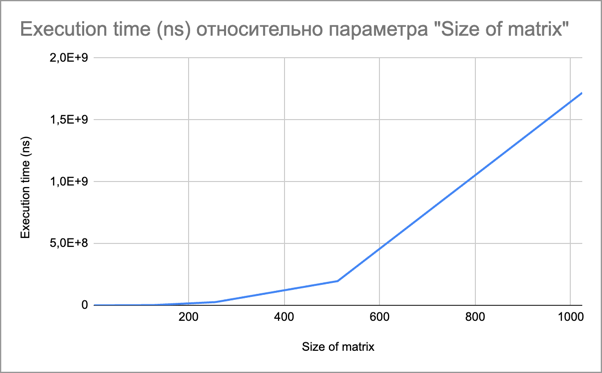

### Отчет по лабораторной работе №1: "Параллельное программирование"

#### Цель работы
Разработка программы на языке С++ для перемножения двух матриц с чтением исходных данных из файлов и записью результата в файл, измерением времени выполнения операции и автоматизированной верификацией результатов с помощью Python.

#### Исходные данные
Для выполнения работы были подготовлены файлы `matrixA.txt` и `matrixB.txt`, содержащие исходные матрицы для перемножения. Формат файлов предусматривает указание размерности матрицы в первой строке (количество строк и столбцов) и последующее перечисление элементов матрицы.

#### Описание реализации на С++
Программа на С++ читает исходные матрицы из файлов, выполняет их перемножение и записывает результат в файл `resultMatrix.txt`. Время выполнения операции умножения измеряется с помощью библиотеки `<chrono>`. Программа проверяет совместимость размеров матриц перед умножением и выводит время выполнения операции в микросекундах.

#### Автоматизированная верификация с помощью Python
Для верификации результатов был написан Python скрипт, который считывает исходные матрицы и результат умножения из соответствующих файлов, выполняет перемножение с помощью библиотеки NumPy и сравнивает полученный результат с содержимым файла `resultMatrix.txt`. В случае совпадения результатов скрипт выводит сообщение о корректности выполненных вычислений.

#### Выводы
Разработанная программа на языке С++ корректно решает задачу перемножения матриц, что было подтверждено с помощью автоматизированной верификации результатов на Python. Использование файлов для ввода исходных данных и вывода результата обеспечивает гибкость и удобство проверки работы программы. Измерение времени выполнения операции умножения позволяет оценить эффективность реализации.

#### Таблица
| Размерность матрицы | Время выполнения (нс) |
|---------------------|-----------------------|
| 2                   | 250                   |
| 4                   | 292                   |
| 8                   | 750                   |
| 16                  | 3583                  |
| 32                  | 25500                 |
| 64                  | 207083                |
| 128                 | 1816417               |
| 256                 | 25760958              |
| 512                 | 195661208             |
| 1024                | 1718972916            |

#### График

