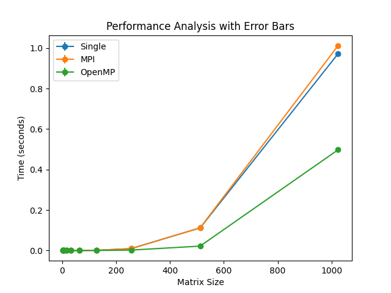

### README.md

# Лабораторная работа №1: "Параллельное программирование"

## Цель работы
Разработка программы на языке С++ для перемножения двух матриц с чтением исходных данных из файлов и записью результата в файл, измерением времени выполнения операции и автоматизированной верификацией результатов с помощью Python.

## Описание реализации на С++
Программа на С++ выполняет следующие действия:
1. Читает исходные матрицы из файлов.
2. Проверяет совместимость размеров матриц для умножения.
3. Выполняет умножение матриц.
4. Записывает результат в файл `resultMatrix.txt`.
5. Измеряет время выполнения операции умножения с помощью библиотеки `<chrono>`.
6. Выводит время выполнения операции в файл.

Программа также содержит реализацию на основе MPI и OpenMP для параллельного выполнения умножения матриц.

## Автоматизированная верификация с помощью Python
Для верификации результатов был написан Python скрипт, который:
1. Генерирует исходные матрицы и сохраняет их в файлы.
2. Запускает программу на С++ для умножения матриц (однопоточную, MPI и OpenMP версии).
3. Считывает исходные матрицы и результат умножения из файлов.
4. Выполняет умножение с помощью библиотеки NumPy и сравнивает полученный результат с содержимым файла `resultMatrix.txt`.
5. Выводит сообщение о корректности выполненных вычислений.
6. Строит график времени выполнения в зависимости от размера матрицы и сохраняет его в файл `single_mpi_omp_comparison.png`.

## Полная автоматизация
Проект полностью автоматизирован:
1. Все необходимые директории и файлы создаются автоматически.
2. Компиляция и сборка программ осуществляется с помощью CMake.
3. Python скрипт автоматически выполняет все этапы генерации данных, запуска программ и верификации результатов.

## Результаты

### График


## Заключение
Разработанная программа на языке С++ корректно решает задачу перемножения матриц, что было подтверждено с помощью автоматизированной верификации результатов на Python. Использование файлов для ввода исходных данных и вывода результата обеспечивает гибкость и удобство проверки работы программы. Измерение времени выполнения операции умножения позволяет оценить эффективность реализации. Программа полностью автоматизирована, что упрощает процесс её использования и проверки.

---

### Запуск проекта

Для запуска проекта выполните следующие шаги:

1. Склонируйте репозиторий:
    ```sh
    git clone <репозиторий>
    cd <папка_репозитория>
    ```

2. Запустите скрипт для создания виртуальной среды venv:
    ```sh
    python3 -m venv .venv
    source .venv/bin/activate
    ```
3. Установите зависимости и запустите главный скрипт:
    ```sh
    pip3 install -r requirements.txt
    python3 main.py
    ```

Скрипт скомпилирует и запустит все версии программы (однопоточную, MPI и OpenMP), проверит корректность их работы и построит график времени выполнения.

---

### Структура проекта

```plaintext
parprog/                          # Директория для сборки проекта
├── CMakeLists.txt                  # Файл конфигурации CMake
├── single.cpp                      # Однопоточная версия программы
├── mpi.cpp                         # Версия программы на основе MPI
├── omp.cpp                         # Версия программы на основе OpenMP
├── main.py                         # Python скрипт для автоматизации
├── README.md                       # Текущий файл
└── single_mpi_omp_comparison.png   # Сгенерированный график
```